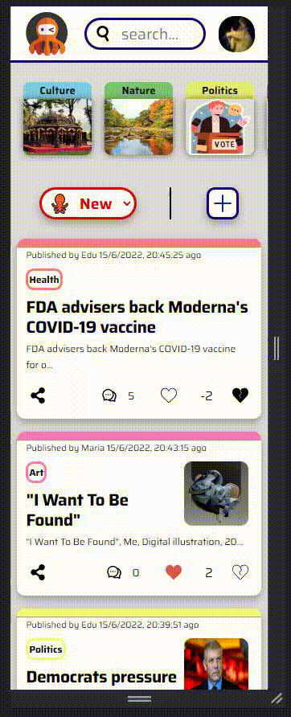

# OctoNews

Octonews is a open-source collaborative news web made with REACT where you will find different categories like 'Culture, Nature, Health...". In there you can post your own news and let the people know more about it. Writing about plants... about countries... even about politics, you choose!

On the front page you will have all the news that have been posted and you have the ability to search for news or sort them for most voted!

Although Octonews is a first mobile web it work from mobile to desktop, you can try it yourself! but here, take a peek.

## - Mobile version

<p align="center">

</p>

## - Desktop version

<p align="center">

</p>

# INSTALL

If you want to check the web in your own computer or server you can do it!
All you need to do is clone this repository on your and make sure that you have Node.js already installed.

Open a terminal on the repository folder and type the following command to install all modules. This command will install all required modules to make the REACT project work.

```cmd
npm install
```

# DATABASE & API

Now you will need the server API and the database that we created specifically for this.

In the link bellow you can find it and the instructions to make it work

- [Octonews API](https://github.com/carmenpelaez/Octonews_API "Octonews API")

# SHARE YOUR OPINION

If you checked the app web, we would love to hear opinions from you. Changes, improvements... anything is welcome! Thank you.
